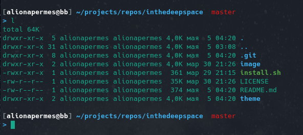

# inthedeepspace

My custom zsh theme based on [intheloop](https://github.com/ohmyzsh/ohmyzsh/wiki/Themes#user-content-intheloop) and inspired by [vim-deep-space](https://github.com/tyrannicaltoucan/vim-deep-space)



## install

Do not forget to install [oh-my-zsh](https://ohmyz.sh/) firstly

```sh
./install.sh
source ~/.zshrc
```

